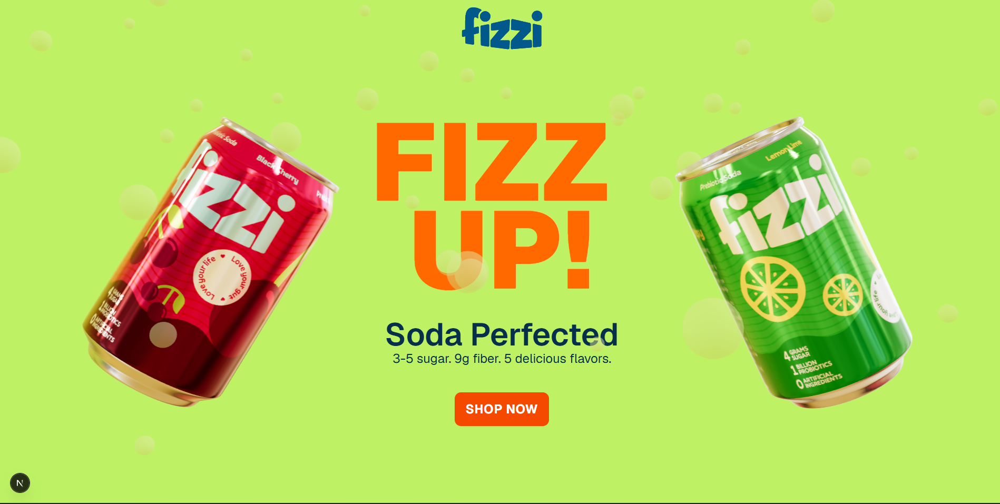
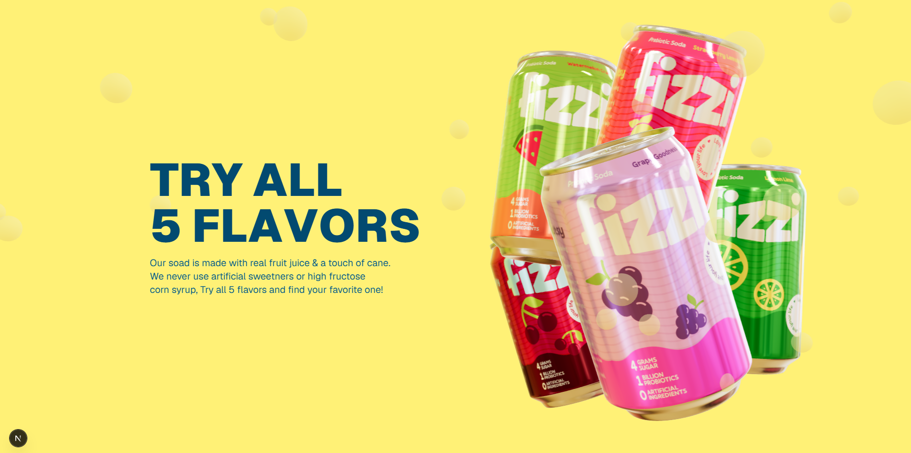
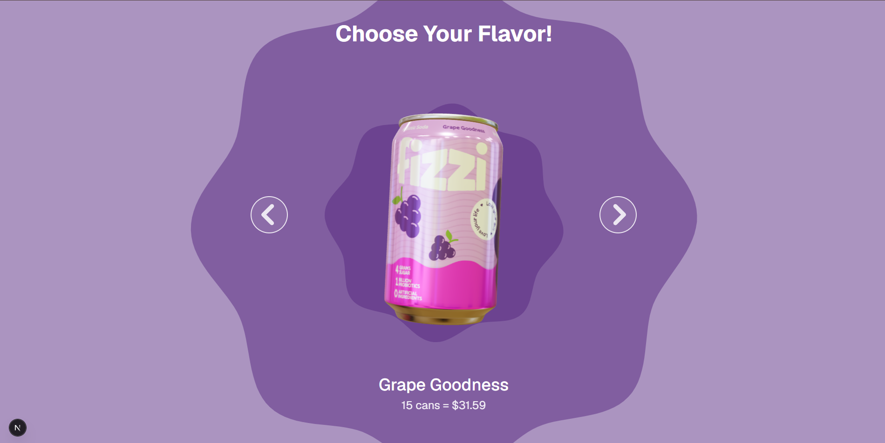

# Fizzi SRD

A modern Next.js experience built for immersive landing pages, motion-driven storytelling, and 3D web visuals.

## Project Preview

<div align="center">
  
  
  
</div>

---

## Tech Stack

This project uses:

- Next.js 16
- React 19
- TypeScript
- Tailwind CSS
- GSAP for animation
- React Three Fiber + Drei + Three.js for 3D scenes
- Zustand for state management
- Prismic CMS integration
- Slice Machine for structured content sections
- ESLint for code quality

---

## Required Packages

### Core dependencies

```bash
npm install next@16.3.0 react@19.2.8 react-dom@19.2.8
npm install @gsap/react gsap clsx three @types/three
npm install @react-three/fiber @react-three/drei
npm install zustand
npm install @prismicio/client @prismicio/next @prismicio/react
```

### Development dependencies

```bash
npm install -D typescript @types/node @types/react @types/react-dom eslint eslint-config-next tailwindcss @tailwindcss/postcss postcss @slicemachine/adapter-next slice-machine-ui r3f-perf
```

> The project already includes these packages in `package.json`, so if you are recreating it from scratch you can install the same set as above.

---

## Step-by-Step Project Setup

### 1) Create a Next.js app

```bash
npx create-next-app@latest fizzi-srd --ts --app --eslint --use-npm
```

Then move into the project folder:

```bash
cd fizzi-srd
```

### 2) Install the required packages

Run the commands from the section above.

### 3) Configure Tailwind

Create the PostCSS config if needed:

```bash
npx tailwindcss init -p
```

In this project, the setup uses:

- `postcss.config.mjs`
- `app/globals.css`
- `@tailwindcss/postcss`

### 4) Install Prismic / Slice Machine

This project uses Prismic CMS and Slice Machine for structured page sections.

```bash
npm install @prismicio/client @prismicio/next @prismicio/react
npm install -D @slicemachine/adapter-next slice-machine-ui
```

Then configure:

- `prismic.config.json`
- `slicemachine.config.json`
- `customtypes/`
- `slices/`

### 5) Install the 3D and animation libraries

```bash
npm install three @types/three
npm install @react-three/fiber @react-three/drei
npm install gsap @gsap/react
npm install zustand
```

### 6) Run the project locally

```bash
npm run dev
```

Open your browser at:

```text
http://localhost:3000
```

### 7) Production build

```bash
npm run build
npm run start
```

---

## Folder Structure

```text
fizzi-srd/
├── app/
│   ├── api/
│   │   ├── exit-preview/
│   │   │   └── route.ts
│   │   ├── preview/
│   │   │   └── route.ts
│   │   └── revalidate/
│   │       └── route.ts
│   ├── globals.css
│   ├── layout.tsx
│   ├── page.tsx
│   └── slice-simulator/
│       └── page.tsx
├── components/
│   ├── Bounded.tsx
│   ├── Button.tsx
│   ├── CircleText.tsx
│   ├── FizziLogo.tsx
│   ├── FloatingCan.tsx
│   ├── Footer.tsx
│   ├── Header.tsx
│   ├── SodaCan.tsx
│   ├── TextSplitter.tsx
│   └── ViewCanvas.tsx
├── customtypes/
│   └── homepage/
│       └── index.json
├── hooks/
│   ├── useMediaQuery.ts
│   └── useStore.ts
├── public/
│   ├── fonts/
│   └── hdr/
│       ├── field.hdr
│       └── lobby.hdr
├── preview/
│   ├── 1.png
│   ├── 2.png
│   └── 3.png
├── slices/
│   ├── index.ts
│   ├── AlternatingText/
│   │   ├── index.tsx
│   │   ├── mocks.json
│   │   └── model.json
│   ├── Banner/
│   │   ├── Bubble.tsx
│   │   ├── index.tsx
│   │   ├── mocks.json
│   │   ├── model.json
│   │   └── Scene.tsx
│   ├── BigText/
│   │   ├── index.tsx
│   │   ├── mocks.json
│   │   └── model.json
│   ├── Carousel/
│   │   ├── ArrowIcon.tsx
│   │   ├── index.tsx
│   │   ├── mocks.json
│   │   ├── model.json
│   │   └── WavyCircles.tsx
│   └── SkyDive/
│       ├── index.tsx
│       ├── mocks.json
│       ├── model.json
│       └── Scene.tsx
├── .eslintrc.*
├── .gitignore
├── AGENTS.md
├── CLAUDE.md
├── eslint.config.mjs
├── next-env.d.ts
├── next.config.ts
├── package.json
├── postcss.config.mjs
├── prismic.config.json
├── prismicio-types.d.ts
├── prismicio.ts
├── README.md
├── slicemachine.config.json
├── tsconfig.json
└── package-lock.json
```

---

## Key Project Notes

- The app uses the App Router pattern in `app/`.
- Interactive motion and animation are handled by GSAP and React Three Fiber.
- CMS-powered sections are organized under `slices/`.
- Custom types and content models are stored in `customtypes/`.
- Global styles and theme foundations are defined in `app/globals.css`.

---

## Useful Scripts

```bash
npm run dev
npm run build
npm run start
npm run lint
npm run slicemachine
```

---

## Notes for Rebuilding This Project

If you want to recreate the same style of app:

1. Start with a Next.js App Router project.
2. Add Tailwind CSS.
3. Add 3D scene support using `three` and `@react-three/fiber`.
4. Add motion animations with GSAP.
5. Add a CMS layer with Prismic and Slice Machine.
6. Build sections like banner, carousel, alternating text, and SkyDive using reusable components.

---

## License

This project is intended for demo and portfolio use unless otherwise specified by the project owner.
